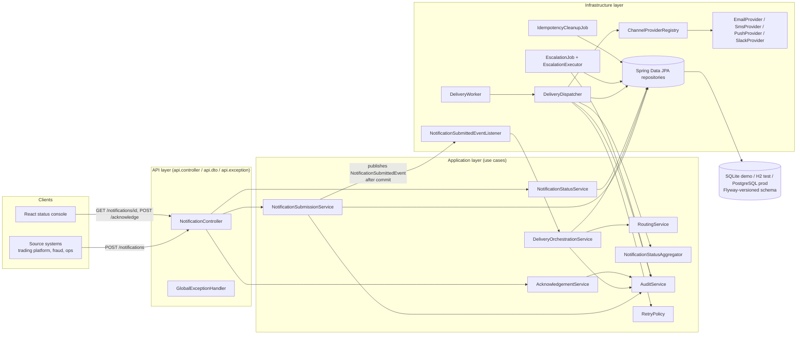
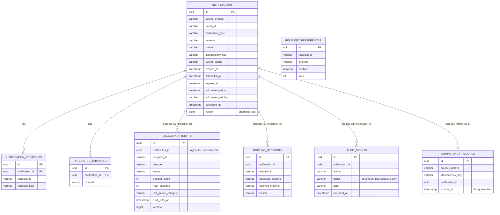
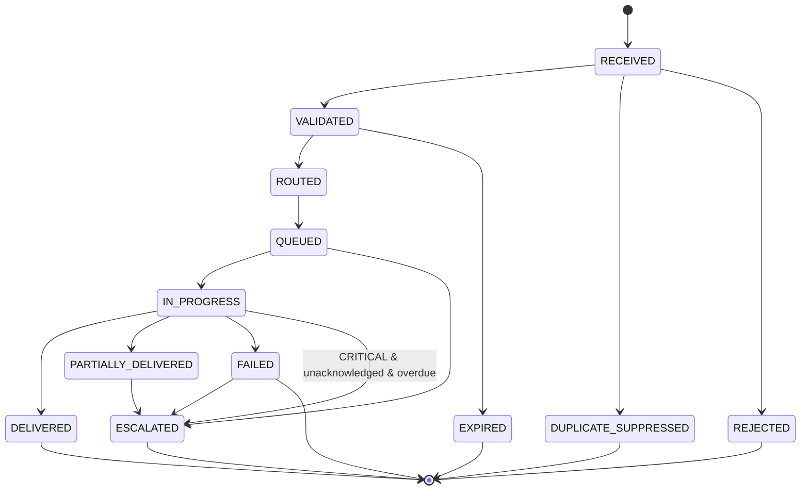
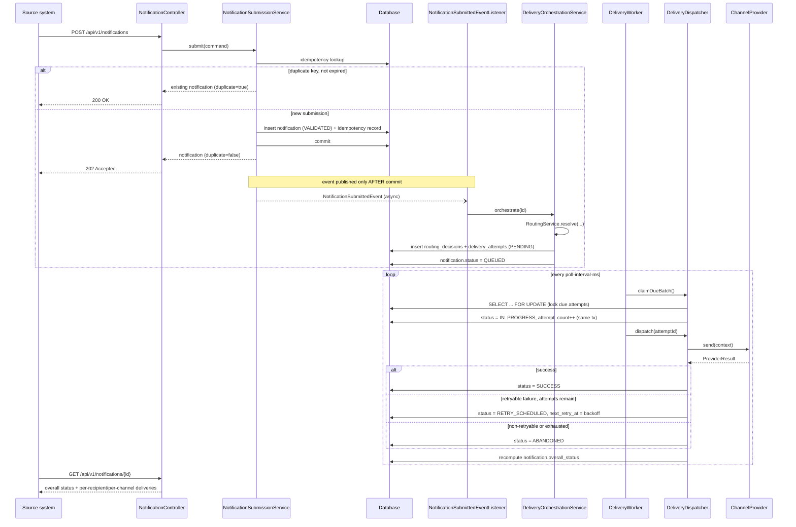

# Architecture Overview — Notification Management Service

## 1. Purpose and scope

A service that receives alert requests from upstream business/technical systems and delivers
notifications to recipients through configurable channels (email, SMS, push, Slack), with
asynchronous processing, bounded retry, deduplication, status retrieval, and an audit trail.
This document covers the backend service. The three graded scenarios (greenfield, brownfield,
ambiguous requirement) are documented separately in `docs/scenarios/`.

## 2. High-level component view

**Why this shape (hexagonal / ports-and-adapters, package-by-layer-then-feature):**

| Package | Responsibility | Depends on |
|---|---|---|
| `api` | HTTP contracts (DTOs, controllers, `@RestControllerAdvice` error mapping). Bean Validation at the boundary. | `application` |
| `application` | Use cases and business rules (routing policy, retry policy, orchestration, aggregation, acknowledgement). No JPA/HTTP types leak in — commands/results are plain records. | `domain`, repository interfaces |
| `domain` | JPA entities and enums — the persistent model and its invariants (e.g. `DeliveryAttempt.isTerminal()`). | nothing (innermost layer) |
| `infrastructure` | Adapters: Spring Data repositories, channel providers (Strategy pattern), scheduled workers, config. | `domain`, `application` interfaces |

This keeps the delivery-channel integrations, the scheduling mechanism, and the persistence
technology all replaceable without touching business logic — e.g. the three database engines
this service runs against (SQLite by default, H2 for tests, PostgreSQL for production, see §2a)
required zero changes to `application`, `domain`, or `api` — only `application*.yml` and one
Maven dependency each; and swapping the polling worker for a Kafka consumer would only touch
`infrastructure.worker` and `infrastructure.provider`.

## 2a. Database choice per environment

Three JDBC configurations, selected purely by Spring profile — the JPA entities, repositories,
and Flyway migrations in `db/migration` are identical across all three:

| Profile | Engine | Why |
|---|---|---|
| *(default)* | **SQLite**, file-based (`backend/data/nms.db`) | Demo/local default. Zero external service to install, yet — unlike H2's in-memory default — data survives an app restart, so a reviewer can stop/start the app or open the `.db` file in any SQLite browser and still see prior submissions. Chosen when this was reprioritized from H2 specifically for demo purposes; see commit history. |
| `test` | **H2**, in-memory, Postgres-compatible mode | Fast, fully isolated per test context (`jdbc:h2:mem:nms-test-${random.uuid}`), zero setup for CI. Kept on H2 rather than moved to SQLite so the well-covered existing test suite (76 tests) stayed untouched by this change — a deliberately conservative choice, not an oversight. |
| `postgres` | **PostgreSQL** | The production target. Real row-level locking (`SELECT ... FOR UPDATE`), proper `UUID`/`TIMESTAMPTZ` types, horizontal scale-out story. See `application-postgres.yml`. |

**Trade-offs accepted for the SQLite default, deliberately, not by oversight:**

- `spring.jpa.hibernate.ddl-auto` is `none` for this profile only (`validate` everywhere else).
  SQLite's dynamic column typing makes Hibernate's schema validator report false-positive
  mismatches against a schema that Flyway actually built correctly; validation would fail the
  app at startup for no real defect. Flyway remains the single source of truth for the schema in
  every profile — this only turns off Hibernate's *redundant* second check for this one profile.
- SQLite does not support row-level locking (`SELECT ... FOR UPDATE` is accepted but a no-op
  under Hibernate's community dialect). This does **not** reopen the double-processing risk
  `DeliveryDispatcher.claimDueBatch()` is designed to close (section 4.4): SQLite serializes all
  writers at the whole-database-file level by default, so two concurrent claim transactions still
  cannot both succeed against the same row — the safety property holds, just via coarser-grained
  locking than Postgres's, which caps this profile to a single writer at a time (fine for a demo,
  not for horizontal scale-out — that's what the `postgres` profile is for).
- `foreign_keys=on` is set explicitly on the JDBC URL — SQLite disables foreign-key enforcement
  (and therefore `ON DELETE CASCADE`) per-connection by default, which the other two engines
  don't require.

## 3. Data model (ER diagram)

`delivery_attempts.(notification_id, recipient_id, channel)` carries a unique constraint — this
is the delivery-level dedup boundary (section 4.4), independent of the request-level
`idempotency_records` boundary. See `docs/scenarios/01-greenfield.md` and
`docs/scenarios/02-brownfield.md` for the full rationale.

## 4. Notification status state machine

`NotificationStatusAggregator` recomputes `DELIVERED` / `PARTIALLY_DELIVERED` / `FAILED` /
`IN_PROGRESS` from the live set of `DeliveryAttempt` rows after every attempt outcome, and
explicitly does **not** overwrite `EXPIRED`, `REJECTED`, or `ESCALATED` once set — those are
terminal-for-aggregation states (see the class javadoc for why `ESCALATED` needed that
protection specifically).

## 5. Submission → delivery sequence

## 6. Async processing without an external broker — trade-off

The prototype uses a DB-backed "poll due work" pattern (`DeliveryAttemptRepository.lockNextBatchDue`,
`@Scheduled` workers) instead of Kafka/SQS/RabbitMQ. This was a deliberate choice for the
assignment's constraints:

- **Pros for this context**: zero extra infrastructure to run/explain, transactional
  consistency between "write the attempt" and "make it visible to the worker" comes for free,
  fully testable with an in-memory H2 database, easy to reason about for a reviewer.
- **Cons at real production scale**: polling has latency floor = poll interval; a single
  logical queue table becomes a write hot-spot under high throughput; horizontal scale-out of
  workers needs `SELECT ... FOR UPDATE`-style locking (implemented — see
  `DeliveryAttemptRepository.lockNextBatchDue`) which still contends on the same rows/index
  under very high concurrency.
- **Production path**: replace `DeliveryWorker`'s poll loop with a Kafka/SQS consumer that
  triggers `DeliveryDispatcher.dispatch(attemptId)` directly; `DeliveryOrchestrationService`
  would publish to the queue instead of relying on the next poll tick. Because the dispatch
  logic already lives in a separate transactional bean called externally, this swap does not
  touch `RoutingService`, `RetryPolicy`, or any channel provider.

## 7. Channel routing policy

See `RoutingService` javadoc and `docs/scenarios/01-greenfield.md` for the full policy and
worked examples: requested channels are filtered by recipient preference (opt-out model), and
`CRITICAL` severity overrides opt-outs and fans out to every channel the platform supports, on
the grounds that a safety-critical alert must not be silently suppressed by a stale preference.

## 8. Retry and failure classification

See `RetryPolicy` and `FailureCategory` javadoc and `docs/scenarios/01-greenfield.md`.
Retryable: `TRANSIENT_PROVIDER_FAILURE`, `TIMEOUT`, `RATE_LIMITED` (honors a provider
`Retry-After` hint when present). Non-retryable (fail fast to `ABANDONED`):
`PERMANENT_PROVIDER_REJECTION`, `INVALID_RECIPIENT`, `AUTH_ERROR`. Exponential backoff,
30s base / 15min cap in production (both externalized via `nms.retry.*` so integration tests
can run the real retry path on a fast clock).

## 9. Deduplication and idempotency boundaries

Two independent boundaries, both required by section 4.4:

1. **Request-level** (`idempotency_records`, unique on `(source_system, idempotency_key)`):
   repeating a submission with the same key returns the original notification instead of
   creating a second logical one. 7-day retention, actively enforced by `IdempotencyCleanupJob`
   (not just documented — see `docs/scenarios/02-brownfield.md`).
2. **Delivery-level** (`delivery_attempts`, unique on `(notification_id, recipient_id, channel)`
   plus `DeliveryDispatcher`'s claim-then-dispatch split): reprocessing a queued delivery cannot
   fan out into a duplicate send, because claiming flips the row to `IN_PROGRESS` inside the
   same locked transaction that read it, and `dispatch()` re-checks status before sending.

## 10. Security and data-handling notes

- Audit records (`AuditEvent.detail`) are populated only with structured metadata (channel,
  attempt counts, failure categories) — never raw message bodies, recipient PII beyond an
  opaque `recipientId`, or provider credentials (section 4.9).
- Bean Validation rejects malformed input at the API boundary before it reaches persistence.
- No secrets are hardcoded; the Postgres profile reads credentials from environment variables
  (`NMS_DB_USERNAME` / `NMS_DB_PASSWORD`).
- `GlobalExceptionHandler` maps internal exceptions to typed API errors rather than leaking
  stack traces.

## 11. What is deliberately out of scope for this prototype

- AuthN/AuthZ on the API (would front this with the org's standard gateway/OAuth2 resource
  server in production — noted, not implemented, to keep the prototype runnable standalone).
- A durable message broker (see section 6).
- Multi-tenant partitioning / rate limiting per source system.
- A real provider integration (SES/Twilio/FCM/Slack API) — providers are simulated
  deterministically; see `docs/testing-strategy.md`.

These are called out explicitly rather than silently absent — see
`docs/testing-strategy.md` for the full limitations/trade-offs list.
